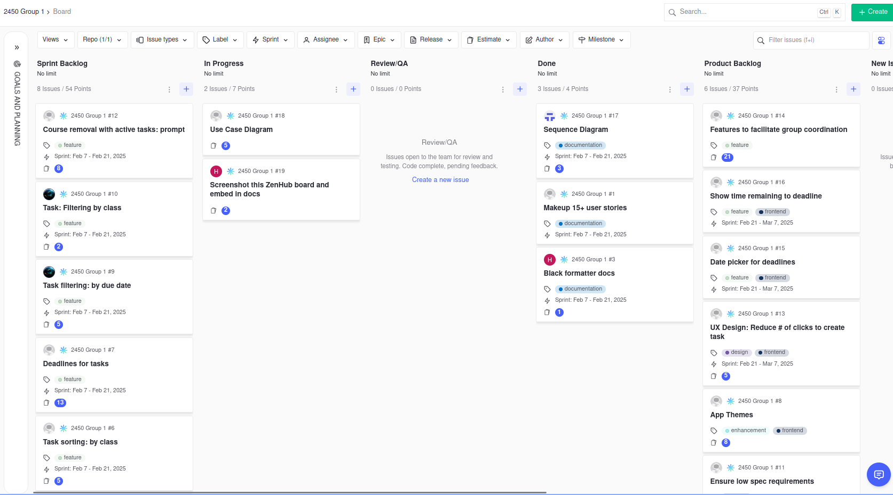

# Agile Artifacts

## ZenHub board

[https://app.zenhub.com/workspaces/2450-group-1-67a67af4a0f29f0029d41e97/board](https://app.zenhub.com/workspaces/2450-group-1-67a67af4a0f29f0029d41e97/board)

### Screenshots

#### 2/7/25

#### 2/14/25

#### 2/20/25

## Github URL

[https://github.com/extremepayne/cs2450-G1](https://github.com/extremepayne/cs2450-G1)

## Sprint 2 Retrospective

### What went well

We made a lot of code in a short time  
Organization was good – we communicated well over discord, got everything done before the deadline with minimal panic  
Learning how to write good test reports  
Good collaboration

### What can be improved

Division of labor between developers/testers was lopsided. Kevin, who is a dev again next sprint, will strive to improve here.  
More granular reporting of the automated tests.  
End-heavy sprint workload.

### Actionable items for next sprint

Kevin will divide work more evenly  
Developers and testers can make the test report more explicit  
Make more things due at the mid-sprint meeting

## Deprecated

**Trello board:** [https://trello.com/b/2wG6FTCp/cs-2450-group-1](https://trello.com/b/2wG6FTCp/cs-2450-group-1)
