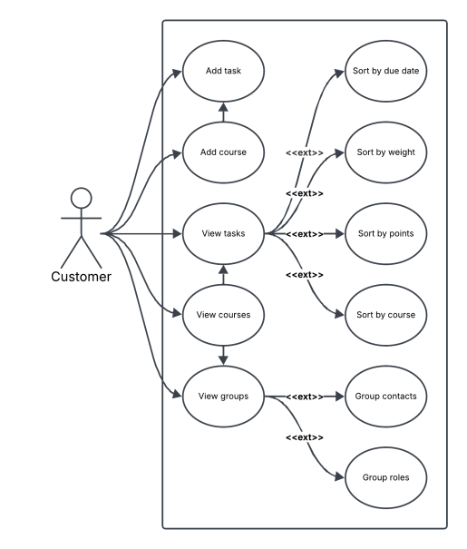
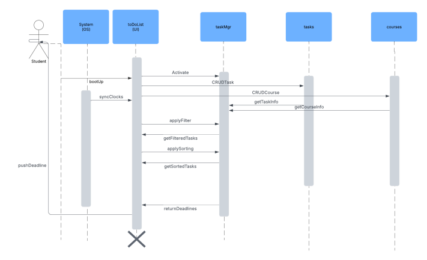
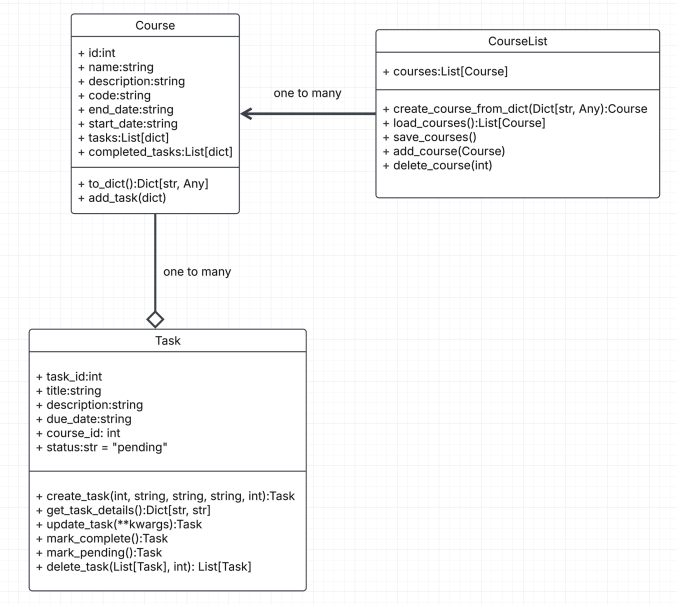

# SRS Document

## Stories

Story 1: As a student, I want to be able to sort by class, so I can see what’s coming in each class.

Story 2: As a student, I want to be able to sort by due date, so I can see what’s due next.

Story 3: As a developer, I want to know how my code should be formatted, so it can fit in well with the others’.

Story 4: As a student who changes courses every semester, I want to be able to easily (but not accidentally) delete a course and all its tasks, so I can stop worrying about past courses.

Story 5: “As a student who works in a group project, I would like a project management application that keeps track of not only the weight of the project, but also the contact info of group mates and be able to assign roles to each other.”

Story 6: “As a student that has a busy life, I would like the application to have a deadline notification system to remind me of any deadlines.”

Story 7: “As a student with a low-end or even potato computer, I want the application to have low resource drain so I can use the app effectively.”

Story 8: “As a student, I want to filter tasks by due date, so I can focus on the day’s tasks and not feel overloaded by all tasks in the class.”

Story 9: “As a busy college student, I want an application that makes it easy for me to add an assignment to my list with a few steps that can be performed quickly.”

Story 10: “As a student who struggles to prioritize my work, I’d like the software to show me how much my upcoming assignments are worth.”

Story 11: “As a person with sensory issues, I’d prefer an application where I can adjust the color scheme to be darker or have colors that create less visual noise for myself.”

Story 12: “As a person who worries about time accuracy, I would like an application that syncs with the computer’s clock for assignments, so I don’t manually have to adjust them myself.”

Story 13: As a student, I would like to add a course so that I can add/filter tasks by course.

Story 14: As a student, I want to see the time remaining until a task’s deadline so that I can prioritize my workload.

Story 15: As a student, I want to edit an existing task so that I can update details when needed.

Story 16: As a student, I want to be able to filter tasks by due date or courses to see relevant information.

Story 17: As a parent, I want to help my child to be organized so that they won’t become overwhelmed and stressed with school.

Story 18: As a student, I want to be able to customize my schedule to my specific needs so that I can have an easier time with my schoolwork.

## Use Cases

Some use cases include:

1. Add tasks

2. Add courses

3. View tasks

    i. Sorted by due date

    ii. Sorted by priority

    iii. Sorted by # of points on grade

    iv. Sorted by course
    
    v. sorted by course

4. View courses

And, if we decide to implement the group work enhancement.

5. View groups

    i. View contact information for members of groups

    ii. View roles for members of groups

You can see these use cases presented visually in the UML diagram below:

## Requirements

### Functional Requirements

Sort tasks by classes

Sort tasks by due dates

Filter tasks by class

Mass delete tasks

Delete courses and all associated tasks

Sync application clock with system clock

CRUD Classes

CRUD Tasks

### Nonfunctional Requirements

Creating or updating a task should save within 500ms

Deleting a task should be persistent (users should never see “ghost tasks”)

Minimal task creation should take three clicks/taps or less

## UI Requirements

### Color scheme

[https://coolors.co/1a1a1a-e6e6e6-808080-12cdd4-b6eefb-ffffff](https://coolors.co/1a1a1a-e6e6e6-808080-12cdd4-b6eefb-ffffff)

### Mock-ups

#### Overall diagram

#### Course sort view

#### Due date sort view

(default)

#### Filtering UI

#### Addtl. notes

## Future Enhancements

- Push reminders when deadline is near

- Tag system

- Theme selection (high contrast, dark, OLED)

- Priority system (e.g. points per assignment, expected workload) (Story 10, 14\)

- Group coordination (Story 5\)

## Diagrams

### Sequence Diagram

### UML Class Diagram

