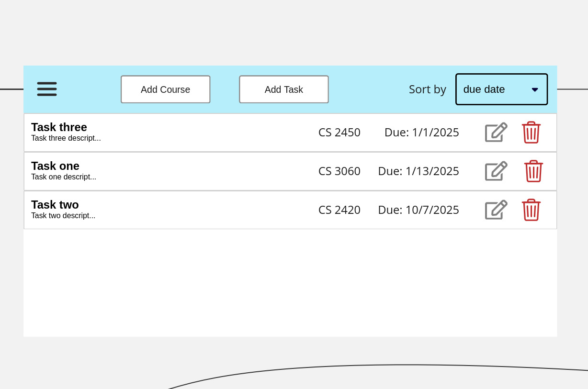
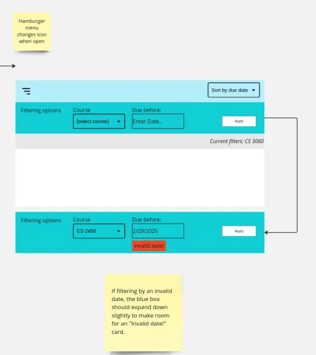

# Software Requirements Specification

Curtis Airmet  
Kevin Bailey  
Ryker Gibbons  
Harrison Payne  
Chun Poon

## 1.0. Introduction

### 1.1. Purpose  
The purpose of this document is to provide a comprehensive description of the Task Manager program. It will explain the program’s purpose, what features it has, how the user interacts with its interface, what the program does, and the program’s restraints.

### 1.2. Scope of the Program  
This program is designed to be a student oriented task manager to help students keep up with their assignments. This program allows a user to create simple tasks, and courses for those tasks to be organized into. These tasks and courses can be quickly created, modified and deleted by the user, allowing them to easily stay on top of all of their assignments. The user must specify end dates for tasks and courses. The due dates for tasks allows for them to be sorted by due date or sorted by course. This program does not include a feature for assigning point values to tasks nor does it include any feature for weighing tasks against each other. It also does not include any system to keep track of the computer’s clock, and thus will not push reminders or automatically remove overdue tasks/courses. 

### 1.3. Intended Audience  
This document is intended for the developers for the purpose of keeping a project vision. This document is additionally intended for the professor of CS 2450 to help them analyze the project.

### 1.4. References
[https://docs.google.com/document/d/1eZLOXpyCVik7IbIjaZJKB-Yq9oeGFA\_hRzf2ykPnQ-8/edit?tab=t.0\#heading=h.bmfd5351rrhf](https://docs.google.com/document/d/1eZLOXpyCVik7IbIjaZJKB-Yq9oeGFA_hRzf2ykPnQ-8/edit?tab=t.0#heading=h.bmfd5351rrhf)  
[https://docs.google.com/document/d/14UVJNgo4ELQzW58uq2KG4P8MO7z85CmCefrprnXiLBQ/edit?tab=t.0\#heading=h.6yfur9wy9jlo](https://docs.google.com/document/d/14UVJNgo4ELQzW58uq2KG4P8MO7z85CmCefrprnXiLBQ/edit?tab=t.0#heading=h.6yfur9wy9jlo)

## 2.0. Overall Description

### 2.1. Product Perspective  
The Task Manager program is a standalone program meant to assist students with their assignment workload. It does not integrate with anything external except for the operating system’s files for saving and loading data.

### 2.2. Product Functions  
The core functions of the Task Manager program include:

- Task and Course Lifecycle Management  
  Includes the creation of a task or course and all of its attributes, the modification of a task or course and its attributes, and the deletion of a task or course and its attributes.  
    
- Sorting System

	Includes sorting tasks by their due date and sorting tasks by their assigned course.

- GUI  
  Includes the interface for viewing tasks and courses, as well as creating, modifying, or deleting them. Additionally includes the interface for sorting as well.

### 2.3. User Classes and Characteristics  
The intended users of this program are students. They should be expected to:

- Know basic computer functions  
- Find the program intuitive with little technological proficiency needed  
- Be able to save their changes, and load them at a later time

### 2.4. Operating Environment  
The Task Manager program is designed to work on Windows, MacOS and Linux. For MacOS, the program is designed for Apple Silicon processors, meaning a MacOS with an intel processor will not be able to run the program. The program runs locally on the user’s system, and requires no internet connection to operate correctly.

### 2.5. Design and Implementation Constraints

- All processes of development will be performed by the student developers of this program.  
- The program will be developed using Python, and using the tkinter library for the gui.  
- Data is stored in 2 files, being task.json for task related data, and course.json for course related data.  
- Code is formatted using the Black python code formatter.

### 2.6. Assumptions and Dependencies  
The following assumptions are made for this program:

- The user’s file system is accessible for data storage  
- The user will enter ending dates that do not happen on or before the starting dates for courses and tasks

## 3.0. Specific Requirements

### 3.1. Functional Requirements

- Sort tasks by due date  
  - The program should allow users to view tasks sorted by their due dates, with the earliest due dates displayed first

- Sort tasks by course  
  - The program should allow users to view tasks of a certain course

- Delete course and associated tasks  
  - The program should let the user delete a course, and all of the tasks it contained

- Delete tasks  
  - The program should let the user delete a specific task

- Create tasks  
  - The program should allow the user to create a task and define its name, description, start date, and due date

- Create courses  
  - The program should allow the user to create a course and define its name, code, description, start date, and end date

- Edit tasks  
  - The program should allow the user to modify an existing task’s attributes

- Edit courses  
  - The program should allow the user to modify an existing course’s attributes

### 3.2. Nonfunctional Requirements

- Fast task creation speed  
  - Creating or updating a task should save within 500ms

- Persistent task deletion  
  - User should never see a “ghost task” after they delete it, the task must be gone entirely

- Easy task creation  
  - Tasks should be created within 3 taps/clicks or less

## 4.0. Future Enhancements

- Clock Synchronization  
  - Create functionality for the program to sync with the device’s clock to stay updated with deadlines.

- Push Notifications for Deadlines  
  - Implement a system to push a reminder to the users’ device when a deadline approaches.

- Mass Task Deletion  
  - Incorporate a function for deleting multiple user selected tasks at once.

- Tag System  
  - Implement a system for the user to create custom tags to assign certain tasks.

- Theme Selection  
  - Add a feature to change the color schematics of the gui.

- Prioritization System  
  - Add a points attribute to tasks and implement features for prioritizing assignments based on their point values

- Group Coordination  
  - Implement features to incorporate group projects such as including contact information, group roles, work division, etc.

## 5.0. Glossary

Terms and Definitions

- Task: An individual assignment or activity that a student needs to complete, characterized by a title and a due date.  
- Course: A class for which tasks are assigned, characterized by a name and code.  
- Due Date: Date by which a task must be finished.  
- End Date: Date on which a course ends, or alternative term for due date.  
- Sort: Function which sorts out tasks by a requirement.  
- GUI: Stands for Graphical User Interface, which is a type of interface which allows users to interact with devices visually.  
- Tkinter: A standard Python interface to the Tk GUI toolkit shipped with Python.

## 6.0. Appendix

### Appendix A: Sequence Diagram

### Appendix B: Use Case Diagram  

 

### Appendix C: UML Class Diagram  

### Appendix D: Wireframe Overview

### Appendix E: Course Sort Wireframe  

### Appendix F: Date Sort Wireframe  

### Appendix G: Filter Wireframe  

### Appendix H: Add/Edit Wireframe  

### Appendix I: Course Deletion Wireframe  

### Appendix J: Task Detail Wireframe  

### Appendix K: Wireframe Notes  

